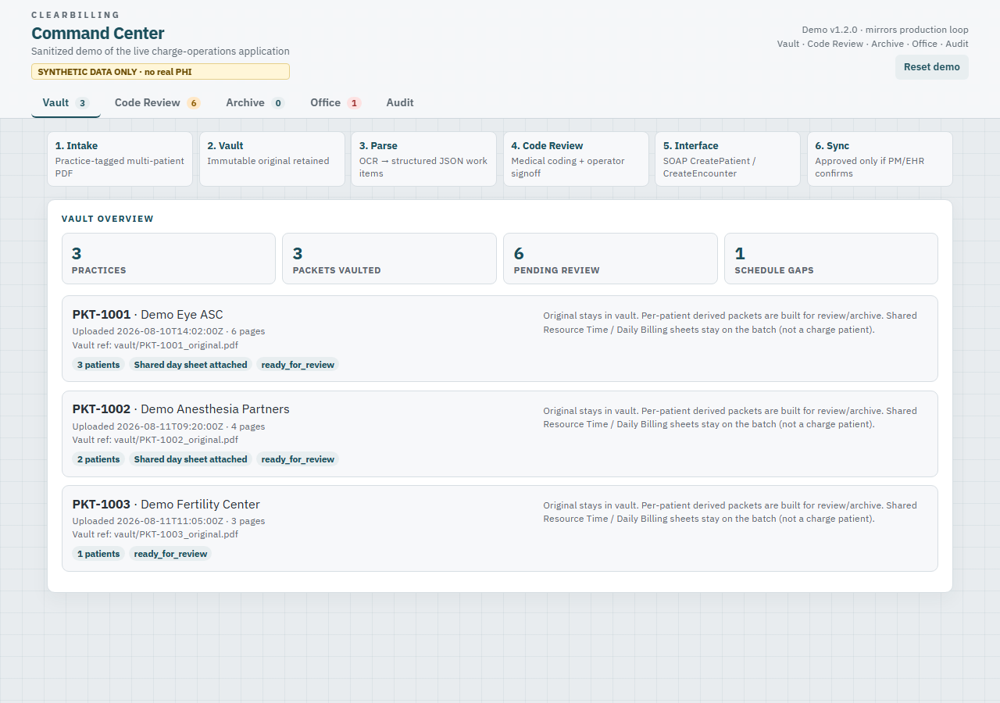
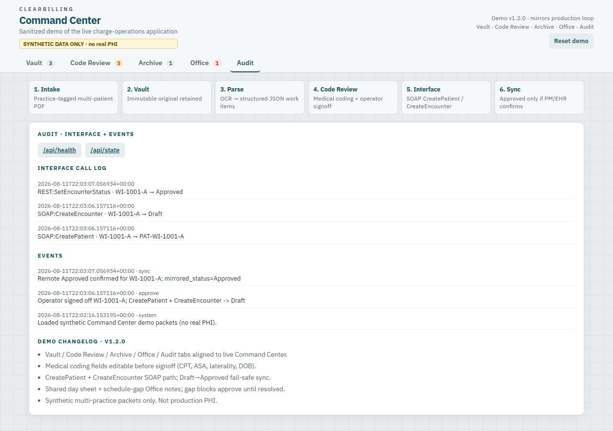

# Benjamin M. Rivera - Healthcare portfolio

This repo is the **portfolio index** (the second link on my resume).  
The runnable flagship is **[ClearBilling Command Center Demo](https://github.com/brivera2005/command-center-demo)** - a **workflow sandbox** of the live system (not a visual clone of production chrome).

Command Center is the live multi-facility anesthesia / clinical charge operations application I built and maintain at ClearBilling Services: vault, medical coding review (CPT/ASA, laterality, DOB, schedule gaps), SOAP/REST posting, fail-safe Draft/Approved sync, Archive / Office / Audit.

> **Synthetic data only.** Production UI, PDF OCR, vault image cache, and vendor integrations stay private for proprietary protection. Public screenshots are of the sandbox.

---

## Open this first

**Repo:** https://github.com/brivera2005/command-center-demo  
**Operator & analyst guide (screenshots + procedures):** https://github.com/brivera2005/command-center-demo/blob/main/docs/OPERATOR_GUIDE.md

### Command Center screenshots (from the public sandbox UI)

These are **not** production screenshots. Live chrome is withheld on purpose.

#### Vault

#### Code Review (medical coding + signoff)

#### Archive

#### Office (schedule gaps / holds)

#### Audit (interface + events)

---

## Featured with Command Center

These two are the supporting demos called out on my GitHub profile (easy to walk through in an interview):

| Project | Focus |
|:--|:--|
| [fhir-patient-timeline](https://github.com/brivera2005/fhir-patient-timeline) | FHIR R4 interop and longitudinal records |
| [prior-auth-copilot](https://github.com/brivera2005/prior-auth-copilot) | Prior-auth documentation gap checks |

## Other practice demos

Available as repos if useful. Not featured on the profile.

| Project | Focus |
|:--|:--|
| [med-reconciliation-agent](https://github.com/brivera2005/med-reconciliation-agent) | Transitions-of-care med safety |
| [phi-deid-scorer](https://github.com/brivera2005/phi-deid-scorer) | De-ID plus residual re-identification risk |
| [icu-pulse-watch](https://github.com/brivera2005/icu-pulse-watch) | Real-time vitals and sepsis-risk style alerts |
| [hospital-bed-flow](https://github.com/brivera2005/hospital-bed-flow) | ED boarding and bed capacity simulation |
| [doc-quality-auditor](https://github.com/brivera2005/doc-quality-auditor) | Explainable clinical note quality gaps |
| [rpm-escalation-hub](https://github.com/brivera2005/rpm-escalation-hub) | Remote monitoring escalation pathways |
| [clinical-reasoning-graph](https://github.com/brivera2005/clinical-reasoning-graph) | Cited clinical reasoning graph |
| [clinical-trial-match](https://github.com/brivera2005/clinical-trial-match) | Explainable trial eligibility |
| [federated-health-demo](https://github.com/brivera2005/federated-health-demo) | Federated learning without moving PHI rows |

---

## Broader work

Across ClearBilling, Amazon private-label product work, and related operations tooling, I have designed and shipped **dozens of real-world applications and operational solutions** - production workflows, interfaces, internal tools, specs, training, and day-to-day support - not slideware.

---

## Links

- LinkedIn: https://linkedin.com/in/brivera2005
- GitHub: https://github.com/brivera2005
- Command Center demo: https://github.com/brivera2005/command-center-demo
- Operator guide: https://github.com/brivera2005/command-center-demo/blob/main/docs/OPERATOR_GUIDE.md
- ClearBilling: https://www.clearbillingservices.com

## Disclaimer

Portfolio demos use **synthetic data**. Not for clinical use. Command Center demo is a workflow sandbox, not the production UI or deployment.
